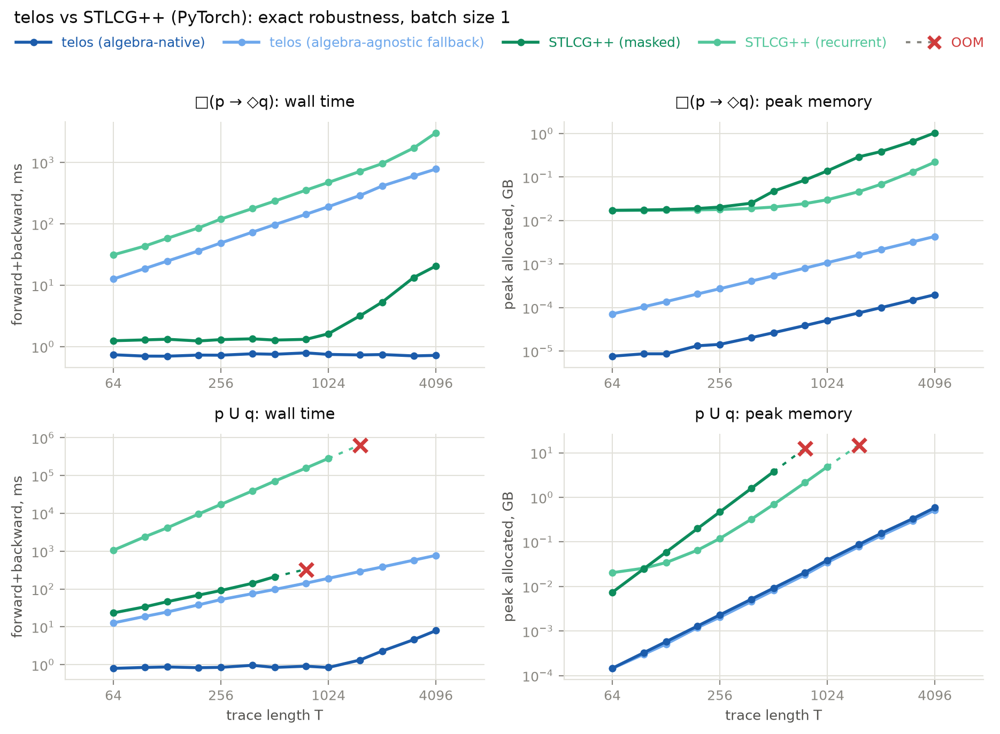
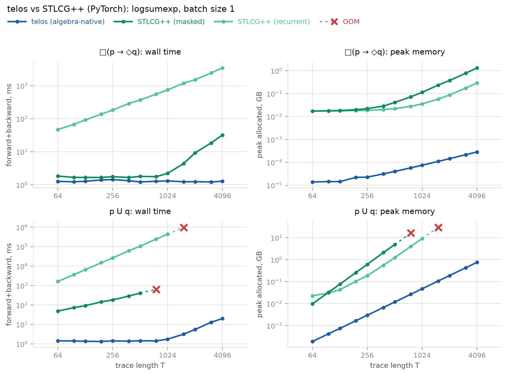
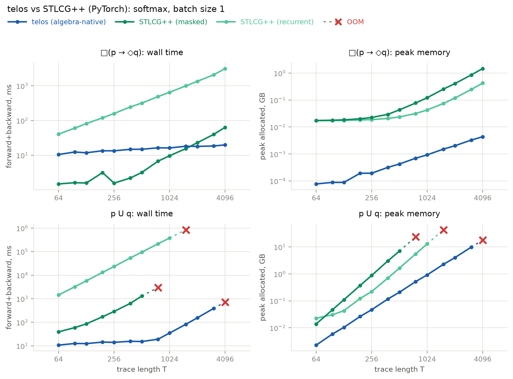

# Telos

[](https://github.com/konstantinosKokos/telos/actions/workflows/tests.yml)

_A framework for evaluating and back-propagating through linear temporal logic traces, in PyTorch._

## About

Telos is a PyTorch library for evaluating and back-propagating through linear temporal logic (LTL) traces. 
Its intended use cases include soft verification and logic-based loss conditioning of neural policies, sequence models, 
adaptive controllers, _etc_. 
Telos is built on a clean separation of syntactic and semantic concerns: formulas are treated as purely syntactic 
objects, the valuations of which depend on the choice of an interpreting algebra. 
The design provides plug-and-play support for arbitrary algebras, and seamless, on-demand switching; 
a user can train with their choice of a continuous algebra, pit it against another (or their own), 
or switch to discrete, boolean-valued semantics at validation or inference time.
The implementation also serves as an abstract specification layer, enabling algebra-generic property-based tests and 
cross-algebra comparisons that go beyond empirical benchmarking.


## Installation
Requires Python `≥ 3.12` and torch `≥ 2.0`.

```bash
pip install -e .            # core library
pip install -e ".[test]"    # plus pytest, hypothesis, numpy
```

## Project Structure

### Syntax

`telos.syntax` defines the shapes of LTL formulas, following standard textbook conventions for primitive operations and 
using Python class inheritance to get around the language's lack of support for ADTs. 

The grammar is defined as
```
Φ := A          -- atomic variable
    | ⊤         -- top
    | ⊥         -- bottom
    | Φ₁ → Φ₂   -- material implication
    | Φ₁ ∨ Φ₂   -- disjunction
    | Φ₁ ∧ Φ₂   -- conjunction
    | ¬Φ        -- negation
    | X(Φ)      -- temporal next
    | U(Φ₁, Φ₂) -- temporal until
    | ◇Φ        -- eventually
    | □Φ        -- always
    | Φ₁ ↔ Φ₂   -- if and only if
```

The operators below are treated as primitives:
- `A` -- `Variable(A)`, where `A` is any valid Python identifier
- `⊤` -- `AbstractTop()`
- `⊥` -- `AbstractBottom()`
- `Φ₁ → Φ₂` -- `Implies(l, r)`, shorthand `l > r`
- `Φ₁ ∨ Φ₂` -- `Disjunction(l, r)`, shorthand `l | r`
- `Φ₁ ∧ Φ₂` -- `Conjunction(l, r)`, shorthand `l & r`
- `¬Φ` -- `Negation(x)`, shorthand `~x`
- `X(Φ)` -- `Next(x)`
- `U(Φ₁, Φ₂)` -- `Until(l, r)`

The rest are defined as composite functions:
- `◇Φ` -- `eventually(x)`, defined as `U(⊤, Φ)`
- `□Φ` -- `always(x)`, defined as `¬◇¬Φ`
- `Φ₁ ↔ Φ₂` -- `iff(l, r)`, defined as `(Φ₁ → Φ₂) ∧ (Φ₂ → Φ₁)`

Formulas are structurally compared and hashed, so they can be used as dictionary keys and pattern matched via 
`__match_args__`.

### Semantics

`telos.algebras` defines the interpretations under which formulas are evaluated. An algebra fixes how each propositional 
connective is computed on values from a chosen carrier; the temporal operators are built on top of these via 
batch-vectorized sequence reductions. Telos ships several standard algebras and exposes a transparent abstract interface 
for adding more.

#### Abstract

An `Algebra` is a `torch.nn.Module` that fixes the semantics of every connective. It declares two designated elements 
(`top` and `bottom`) and four pointwise primitives:

| Connective   | Method          |
|--------------|-----------------|
| `Φ₁ ∧ Φ₂`    | `meet(x, y)`    |
| `Φ₁ ∨ Φ₂`    | `join(x, y)`    |
| `Φ₁ → Φ₂`    | `implies(x, y)` |
| `¬Φ`         | `neg(x)`        |

The temporal operators are carried by `shift` (for `X`) and five sequence reductions (`running_meet`, `running_join`, 
`exists`, `forall`, and `span_meet`). `Algebra` itself supplies no bodies and commits to no carrier; three intermediate 
classes do so, each along a different route:

- `Folded` derives every reduction from the pointwise primitives via functional iterators (`scan`, `fold`, and a 
  triangular-mask `span` combinator); `top` and `bottom` are registered as buffers. The derived definitions double as 
  an executable specification: subclasses override them with a vectorized closed form where one exists, and 
  `tests/test_overrides.py` checks each override against the fold it displaces, in both value and gradient. A 
  convenience subclass `Fuzzy` handles the common case of a `[0, 1]` carrier with `neg(x) = 1 - x`.
- `Archimedean` specializes `Folded` to t-norms with an additive generator: implement the generator pair `g`/`g_inv`, 
  and the pointwise operations, the residuum, and optimized sequence reductions (sums and cumulative sums in 
  generator space) all come for free.
- `Lifted[S: State]` reduces over a monoidal state rather than over the carrier, for semantics whose sequence 
  reductions are not folds of their binary operation. Implementations provide an associative `combine` on states and 
  an `embed`/`readout` pair that is a _section_ (i.e. `readout ∘ embed = id`); the reductions are then derived as 
  logarithmic-depth parallel scans.

Since `Algebra` extends `Module`, its parameters (if any) are first-class, and can optionally be trained end-to-end 
just like a standard PyTorch module.

#### Existing Implementations

The algebras in the table below are implemented and property tested.

**Legend**:
* idempotence (Idem), absorption (Abs), distributivity (Dist), complementarity (Comp), monotonicity (Mono)
* Gradient Profile -- shape of the total gradient mass, and how it scales with trace duration: _sparse_ concentrates 
  the entirety of the mass in a single tick of a single atom, _dense_ preserves it and distributes it across 
  participants, _dec._ keeps it nonzero while attenuating it at the noted rate, and _sat._ sends it to 
  exactly zero past a modest duration

See `algebras` for the implementations, 
`tests/test_properties.py` for the law checks, 
and `tests/test_gradients.py` for the gradient ones.

| Algebra          | Carrier     | Diff  | Train | Idem  | Abs   | Dist  | Comp  | Mono  | Gradient Profile |
|------------------|-------------|:-----:|:-----:|:-----:|:-----:|:-----:|:-----:|:-----:|:----------------:|
| `Boolean`        | `𝔹`        |       |       |   ✓   |   ✓   |   ✓   |   ✓   |   ✓   |       n/a        |
| `Goedel`         | `[0, 1]`    | [^a]  |       |   ✓   |   ✓   |   ✓   |       |   ✓   |     _sparse_     |
| `KleeneDienes`   | `[0, 1]`    |   ✓   |       |   ✓   |   ✓   |   ✓   |       |   ✓   |     _sparse_     |
| `Lukasiewicz`    | `[0, 1]`    |   ✓   |       |       |       |       |   ✓   |   ✓   |      _sat._      |
| `Product`        | `[0, 1]`    |   ✓   |       |       |       |       |       |   ✓   |   _dec. (exp)_   |
| `Robustness`     | `ℝ ∪ {±∞}`  |   ✓   |       |   ✓   |   ✓   |   ✓   |       |   ✓   |     _sparse_     |
| `Frank`          | `[0, 1]`    |   ✓   |   ✓   | [^c]  | [^c]  | [^c]  | [^b]  |   ✓   |   _dec. (exp)_   |
| `Hamacher`       | `[0, 1]`    |   ✓   |   ✓   |       |       |       |       |   ✓   |   _dec. (exp)_   |
| `Yager`          | `[0, 1]`    |   ✓   |   ✓   | [^b]  | [^b]  | [^b]  | [^d]  |   ✓   |      _sat._      |
| `SchweizerSklar` | `[0, 1]`    |   ✓   |   ✓   |       |       |       | [^e]  |   ✓   |      _sat._      |
| `AczelAlsina`    | `[0, 1]`    |   ✓   |   ✓   | [^b]  | [^b]  | [^b]  |       |   ✓   |   _dec. (exp)_   |
| `Dombi`          | `[0, 1]`    |   ✓   |   ✓   | [^b]  | [^b]  | [^b]  |       |   ✓   |  _dec. (poly)_   |
| `SugenoWeber`    | `[0, 1]`    |   ✓   |   ✓   |       |       |       | [^c]  |   ✓   |      _sat._      |
| `LSE`            | `ℝ ∪ {±∞}`  |   ✓   |   ✓   | [^b]  | [^b]  | [^b]  |       |   ✓   |     _dense_      |
| `Boltzmann`[^f]  | `ℝ ∪ {±∞}`  |   ✓   |   ✓   |   ✓   |       |       |       |       |     _dense_      |
| `Mellowmax`[^f]  | `ℝ ∪ {±∞}`  |   ✓   |   ✓   |   ✓   |       |       |       |   ✓   |     _dense_      |

[^a]: `Implies` is _not_ differentiable in its first argument.
[^b]: When `p → ∞`.
[^c]: When `p → 0`.
[^d]: When `p = 1`.
[^e]: When `p ≥ 1`.
[^f]: Binary `∧`/`∨` are non-associative at finite `β` (exact as `β → ∞`); associative and unital in state space.

Picking one: `Mellowmax` is the only entry that is simultaneously idempotent (so `□`/`◇` do not drift with trace 
duration), monotone, and dense. `Goedel` and `Robustness` are idempotent and monotone but sparse; `LSE` is dense and 
monotone but not idempotent, so its verdicts move with duration; `Boltzmann` is dense but non-monotone. Everything on 
`[0, 1]` either saturates or decays.

#### Writing your Own

Pick the entry point that matches your semantics. Subclass `Folded` (or `Fuzzy`) and implement or inherit the top and 
bottom elements and the four pointwise primitives; sequence reductions inherit defaults, which you can override where a 
vectorized closed form exists. If your t-norm has an additive generator, subclass `Archimedean` and implement just 
`g`/`g_inv`. If your reductions don't arise as folds of the pointwise primitives, subclass `Lifted` with a `State` 
carrying an associative `combine`.

See `telos.algebras.goedel` for a minimal reference, `telos.algebras.frank` for an example with a trainable 
parameter, and `telos.algebras.mellowmax` for a lifted algebra.

#### Auditing your Own

The audit predicates are library code and apply to any algebra:

- `telos.algebras.properties` expresses each law as a combinator over the operations it constrains -- 
  `commutative`, `associative`, `idempotent`, `absorption`, `distributive`, `involutive`, `de_morgan`, 
  `complementary`, `monotone`, `unital`, `zero_free`, `residuated`, `adjoint`, `generated`.
- `telos.algebras.gradients` probes the backward pass -- `selective`, `nonnegative`, `normalized`, and `regime`, 
  the last classifying gradient decay from a duration ladder of gradient masses.

The suites in `tests/` run these over the whole catalogue, and additionally assert that each declared law _failure_ is 
witnessed by a counter-example.

### Interface

`telos.deduction` connects syntax and semantics. The three objects of interest are:
- `Trace(values, names)` -- a glorified tensor of shape `(..., vars, time)`, naming its coordinates along `dim=-2`. 
  Can be built via the helper `mkTrace(**vars)`. 
- `Judgement(trace, conclusion)` -- a pairing of a trace and a formula whose leaf variables must occur in the trace.
- `Model(algebra)` -- a `torch.nn.Module` that lifts an algebra to a judgement evaluation engine.

Evaluation is structural recursion: pointwise constructors call the algebra's primitives. The temporal cases are 
compiled rather than interpreted tick by tick: `◇`/`□` are recognized syntactically and become running reductions over 
reversed time, while an unbounded `U` builds the triangular `span_meet` of its left argument and reduces against its 
witness. Passing `return_trajectory=True` returns the valuation at every tick instead of just the first.

#### Example

Here's a minimal example demonstrating an end-to-end pipeline.

```python
import torch
from telos import mkTrace, Variable, eventually, always, Model, Lukasiewicz, Product, Boolean

p, q = Variable('p'), Variable('q')              # p and q are abstract symbols
phi = always(p > eventually(q))                  # φ := □(p → ◇q)

trace_f = mkTrace(
    p=(tp := torch.rand(4, requires_grad=True)), # the fp32 progress of p (e.g., sensor measurements, classifier outputs, etc.)
    q=(tq := torch.rand(4, requires_grad=True)), # ditto for q
)                                                # the two variables packed up in a single trace
trace_b = trace_f.bool()                         # the discretization of the above trace

judgement_f = trace_f >> phi                     # the judgement τ ⊨ φ, in the fp32 domain
judgement_b = trace_b >> phi                     # the same judgement in the boolean domain

score_l = Model(Lukasiewicz())(judgement_f)      # apply the Lukasiewicz algebra on the judgement
score_p = Model(Product())(judgement_f)          # ditto, now with the Product algebra
score_b = Model(Boolean())(judgement_b)          # ditto, now with the Boolean algebra -- note the domain change

traj_l = Model(Lukasiewicz())(
    judgement_f, 
    return_trajectory=True
)                                                # return the valuation of φ at each step

goal_f  = torch.rand(())                         # some goal valuation to train on
loss    = torch.nn.functional.l1_loss(
    input=score_l,
    target=goal_f
)
loss.backward()                                  # backprop through the algebra, populating grads for tp and tq
```

Same formula, multiple algebras and evaluations across two trace dtypes.

## Implementation Notes
- Telos evaluates LTL over finite, fixed-duration traces and cannot work with infinite streams.
- `X(Φ)` is padded with `algebra.bottom` past the last time step, biasing trace-edge readings toward dissatisfaction. 
  For the averaging algebras (`Boltzmann`, `Mellowmax`) `bottom` is a finite sentinel that participates in the mean 
  rather than annihilating it, so the padding reads as one emphatic vote instead of a hard floor.
- `U(Φ₁, Φ₂)` uses the overlapping convention: `Φ₁` must hold at every tick up to and including the one that 
  witnesses `Φ₂`.
- `◇` and `□` cost linear time in the trace duration; an unbounded `U` costs quadratic time and memory.
- Every algebra is associated with its own domain; you're responsible for using the right dtype.
- `Boltzmann` is non-monotone at finite `β`: raising a value can lower the verdict. Prefer `Mellowmax` unless the 
  Boltzmann average is specifically what you want.

## Benchmarks

### Comparison to STLCG++

Three Telos algebras map directly to [STLCG++](https://github.com/UW-CTRL/stlcg-plus-plus)'s three approximation
methods: `Robustness` to `'true'`, `LSE` to `'logsumexp'`, and `Boltzmann` to `'softmax'`. Under each pairing,
Telos reproduces STLCG++ valuations up to finite precision arithmetic, over randomly generated formulas and traces.
The two differ in evaluation cost: Telos's scan-based temporal operators run in linear (`◇`, `□`) and quadratic time
(unbounded `U`), whereas STLCG++'s masking is quadratic and cubic, respectively, making it unworkable for longer traces.





Parity checks and measurements: [`benchmarks/stlcgpp/benchmark.ipynb`](benchmarks/stlcgpp/benchmark.ipynb).
